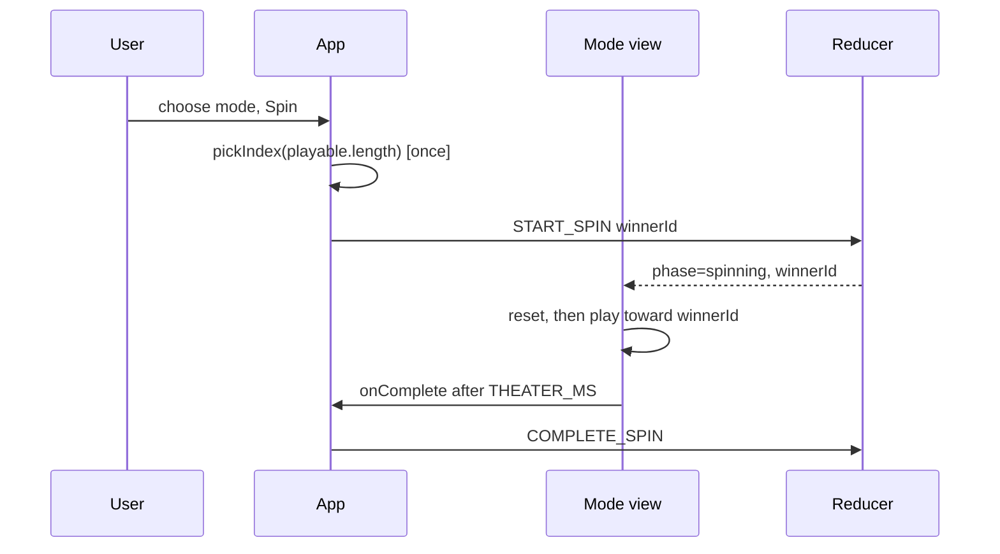

# Design: Add Claw Machine and Elimination Board Modes

## Technical Approach

Same contract as horse race: App picks once, dispatches `START_SPIN`, and each mode receives `winnerId` + `phase` + `onComplete`. Theater is CSS position/opacity plus sequenced timeouts. Modes MUST NOT call `pickIndex`.



## Architecture Decisions

| # | Decision | Choice | Alternatives rejected | Rationale |
|---|----------|--------|----------------------|-----------|
| 1 | Claw motion | Aim (X) → drop (Y) → grab → lift; durations in `theater.ts` | One CSS keyframe; rAF physics | Testable steps; no second pick; matches horse-race reset-then-run |
| 2 | Claw geometry | `clawColumns` = `min(4, count)`; left/top from cell center helpers | Fixed 4-col grid; measuring DOM boxes | Deterministic strings for tests; works at 2 and 12 |
| 3 | Grab presentation | Winner prize `data-grabbed`; claw holds the label while lifting | Physically moving the node | jsdom-friendly; label stays text |
| 4 | Elimination order | Losers in option order, skip winner; times spread across `THEATER_MS - HOLD` | Random knockout order | Random order would be a second RNG |
| 5 | Repeat spins | Instant reset (`0ms`), then arm after `*_RESET_MS` | Reverse animation; remount | Same lesson as horse race |

## File Changes

| File | Action | Description |
|------|--------|-------------|
| `src/domain/types.ts` | Modify | `Mode` includes both new values |
| `src/ui/modes/theater.ts` | Modify | Durations and claw/elimination constants |
| `src/ui/modes/ClawMachine.tsx` | Create | Cabinet, helpers, sequenced claw |
| `src/ui/modes/ClawMachine.module.css` | Create | Arcade cabinet, rail, claw, prizes |
| `src/ui/modes/ClawMachine.test.tsx` | Create | No pickIndex; grab winner; reset on repeat |
| `src/ui/modes/EliminationBoard.tsx` | Create | Lights, knockout helpers |
| `src/ui/modes/EliminationBoard.module.css` | Create | Game-show board |
| `src/ui/modes/EliminationBoard.test.tsx` | Create | No pickIndex; winner stays lit; reset on repeat |
| `src/ui/ModePicker.tsx` | Modify | Two radios |
| `src/persistence/localStore.ts` | Modify | Accept both modes |
| `src/App.tsx` | Modify | Render both views |
| `README.md` | Modify | List both modes |

## Interfaces / Contracts

```ts
export const CLAW_RESET_MS = 40
export const CLAW_AIM_MS = 1100
export const CLAW_DROP_MS = 900
export const CLAW_GRAB_MS = 250
export const CLAW_LIFT_MS = 1750
// THEATER_MS['claw-machine'] = AIM+DROP+GRAB+LIFT = 4000

export const ELIMINATION_RESET_MS = 40
export const ELIMINATION_HOLD_MS = 800
// THEATER_MS['elimination-board'] = 5000

export function clawColumns(count: number): number
export function clawAimLeft(index: number, count: number): string
export function clawDropTop(index: number, count: number): string

export function eliminationAtMs(loserRank: number, loserCount: number): number
```

Claw `onComplete` fires at `CLAW_RESET_MS + THEATER_MS['claw-machine']`.
Elimination `onComplete` fires at `ELIMINATION_RESET_MS + THEATER_MS['elimination-board']`.

## Testing Strategy

| Layer | What to Test | Approach |
|-------|-------------|----------|
| Unit | Claw positions; elimination times; no `pickIndex`; onComplete; repeat reset | Vitest + Testing Library, fake timers |
| Integration | Mode picker + App render each stage | Existing ModePicker/App tests |
| E2E | None | Manual smoke via `bun run dev` |

## Threat Matrix

N/A — client-only presentation modes; no new trust boundary.

## Migration / Rollout

No migration. Unknown stored modes already return `null` and fall back to defaults.

## Open Questions

- None.
