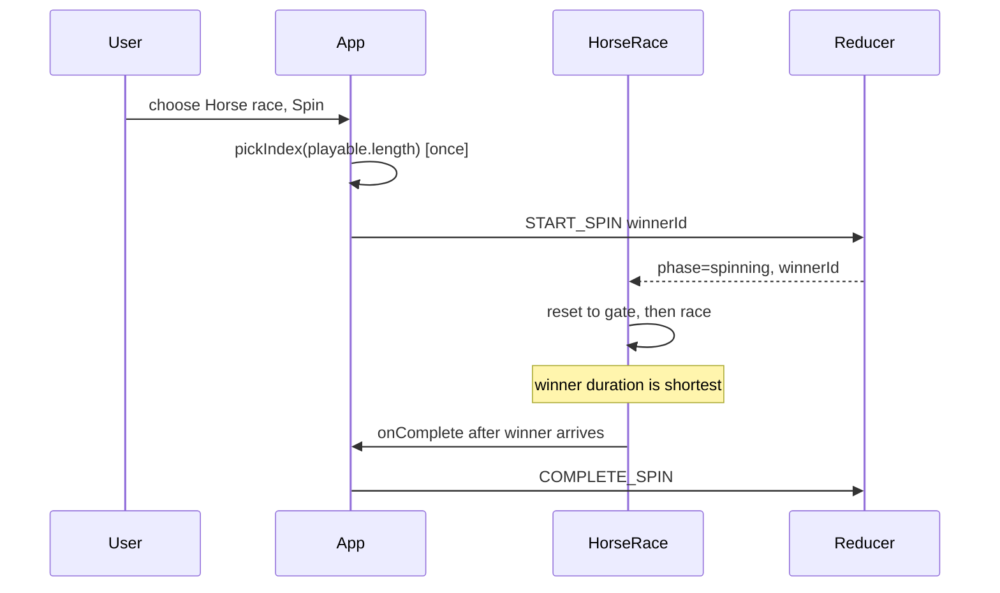

# Design: Add Horse Race Mode

## Technical Approach

Same contract as roulette and slots: `App` picks once, dispatches `START_SPIN`, and HorseRace receives `winnerId` + `phase` + `onComplete`. Theater is CSS `left` transitions. The winning horse uses `THEATER_MS['horse-race']`; losers use a longer stagger so they cannot arrive first.



## Architecture Decisions

| # | Decision | Choice | Alternatives rejected | Rationale |
|---|----------|--------|----------------------|-----------|
| 1 | Winner arrives first | `horseDurationMs`: winner = `THEATER_MS['horse-race']`; losers = winner + stagger | Random per-horse speeds; rAF physics | Deterministic, testable, no second pick |
| 2 | Repeat spins | Instant reset (`0ms`) to the gate, then `HORSE_RACE_RESET_MS` later set running | Reverse back to start; remount key | Reverse would look like the winner running backward; remount loses labels mid-frame |
| 3 | Motion | CSS `left` + per-horse `transitionDuration` | canvas, rAF loop | Matches roulette/slots; fake-timer friendly |
| 4 | Labels | Option label on each horse | Color-only lanes | Spec: result as text, not color alone |

## File Changes

| File | Action | Description |
|------|--------|-------------|
| `src/domain/types.ts` | Modify | `Mode` includes `'horse-race'` |
| `src/ui/modes/theater.ts` | Modify | `THEATER_MS['horse-race'] = 6000` |
| `src/ui/modes/HorseRace.tsx` | Create | Track, `horseDurationMs`, reset-then-run |
| `src/ui/modes/HorseRace.module.css` | Create | Dirt track, lanes, finish line, gallop |
| `src/ui/modes/HorseRace.test.tsx` | Create | No pickIndex; winner shortest duration; reset on repeat |
| `src/ui/ModePicker.tsx` | Modify | Horse race radio |
| `src/persistence/localStore.ts` | Modify | Accept `horse-race` |
| `src/App.tsx` | Modify | Render HorseRace |
| `README.md` | Modify | List horse race |

## Interfaces / Contracts

```ts
export const HORSE_RACE_STAGGER_MS = 420
export const HORSE_RACE_RESET_MS = 40

export function horseDurationMs(
  optionId: string,
  winnerId: string,
  optionIndex: number,
  winnerIndex: number,
): number
```

Winner duration is always strictly less than every loser. `onComplete` fires at `HORSE_RACE_RESET_MS + THEATER_MS['horse-race']`.

## Testing Strategy

| Layer | What to Test | Approach |
|-------|-------------|----------|
| Unit | Winner duration < losers; no `pickIndex`; onComplete after winner arrives; repeat race resets then runs | Vitest + Testing Library, fake timers |
| Integration | Mode picker + App render the track | Existing ModePicker/App tests |
| E2E | None | Manual smoke via `npm run dev` |

## Threat Matrix

N/A — client-only presentation mode; no new trust boundary.

## Migration / Rollout

No migration. Unknown stored modes already return `null` and fall back to defaults.

## Open Questions

- None.
