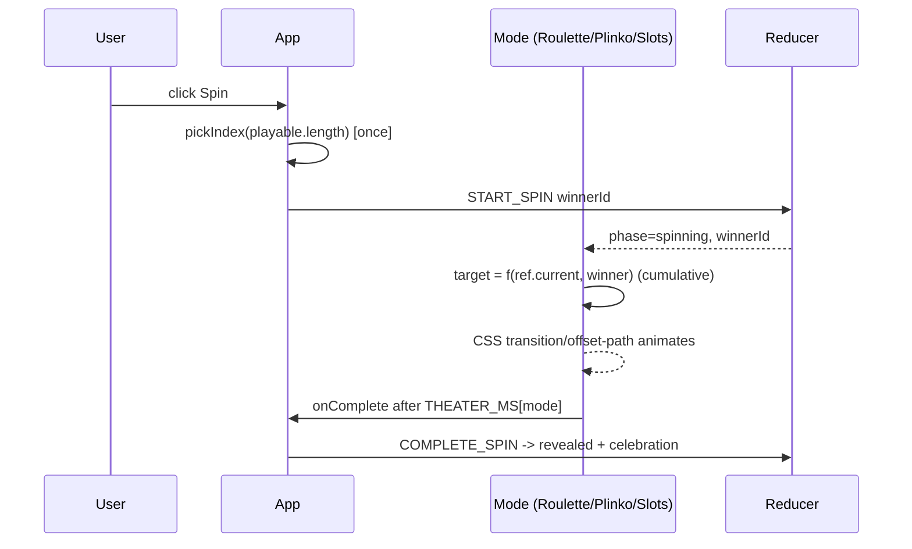

# Design: Revamp Mode Animations

## Technical Approach

Keep the result-first flow untouched: `App.handleSpin` calls `pickIndex` once, dispatches `START_SPIN`, and each mode receives `winnerId` + `phase` + `onComplete`. All fixes live in the presentation layer. The core pattern change: **absolute animation targets become cumulative targets derived from a per-instance ref**, so every spin advances forward. Plinko swaps its straight ramp for a feasibility-guarded random bounce path. Polish (durations, celebration, editor Enter) is CSS modules + props only.



## Architecture Decisions

| # | Decision | Choice | Alternatives rejected | Rationale |
|---|----------|--------|----------------------|-----------|
| 1 | Roulette repeat spins | `rotationRef` + `targetRotation(currentDeg, winnerIndex, count)` = `ceil(current/360)*360 + TURNS*360 + (360 − winnerCenter)` | Normalize angle mod 360 each reveal | Delta term is always in (0,360), so advance ≥ TURNS full turns even on same winner; accumulated degrees are doubles — no precision risk; no normalization render needed |
| 2 | Slots repeat spins | `positionRef` + **declarative snap**: on reveal, 0ms snap to `winnerIndex * H`; next spin targets `current + LOOPS*cycle + mod(winnerPx − current, cycle)` | Grow reel items forever; imperative style + forced reflow | Items array is finite, so accumulation is impossible without normalization. Snap lands on a congruent item (repeats each cycle), so it is invisible. React state-driven (separate renders) — no reflow hack |
| 3 | Reel length | Render `LOOPS + 2` copies (5) | LOOPS (3) copies | Worst-case target is `(5count − 2)` items after snap; 5 copies is the fixed bound |
| 4 | Plinko bounce path | `bouncePath(winnerIndex, count, rng?)`: per peg row pick `dir ∈ {−1,+1}` via rng, **filtered to dirs keeping the winner lane reachable within remaining rows** and inside the board; end segment drops into winner slot | Pure random walk + repair; reserve K steering rows | MAX_OPTIONS=12 exceeds ROWS=8, so a fixed steering tail cannot guarantee arrival. The feasibility guard guarantees landing with natural-looking randomness; presentation-only rng never touches the winner |
| 5 | Plinko animation | Keep CSS `offset-path` + `travel` keyframes on the new zig-zag `d` | rAF loop; per-keyframe WAAPI | Already jsdom/fake-timer friendly, compositor-driven, zero JS loop. Peg flashes via per-row `animation-delay` stagger give bounce readability |
| 6 | Ghost path | Delete `<path className={styles.ghostPath}>` and its CSS | Fade it out | Spec: MUST NOT preview result |
| 7 | Durations | `THEATER_MS: Record<Mode, number> = { roulette: 4000, plinko: 3000, slots: 3000 }` in `theater.ts` (scalar → map) | Per-mode constants scattered in files | Single source of truth; tests already import from `theater.ts` |
| 8 | Celebration | `ResultBanner` gets `data-phase`; revealed state pops (scale keyframe) + 6 CSS-only confetti `<span aria-hidden>`; winning plinko slot pulses | Confetti library; canvas | No new deps; `prefers-reduced-motion` disables all of it |
| 9 | Spin button | Idle pulse keyframe on `.spin:not(:disabled)`; `data-spinning`/`aria-busy` while spinning | JS-driven pulse | Pure CSS, gated by `prefers-reduced-motion: no-preference` |
| 10 | Editor Enter/placeholders | `onKeyDown` Enter → `onAdd()` when `canAdd && !disabled`; placeholder `` `e.g. Restaurant ${A + index}` `` | Form submit wrapper | No form exists; keydown is minimal and testable |

## Data Flow

Unchanged at the state layer. Inside each mode:

```
winnerId ──> winnerIndex ──> target = f(ref.current, winnerIndex)
                                  │
ref.current = target  <───────────┘  (slots: snap-normalize on reveal)
                                  │
              transform/offset-path ──> setTimeout(THEATER_MS[mode]) ──> onComplete
```

`pickerReducer`, `domain/*`, persistence, aria-live, and the reduced-motion `COMPLETE_SPIN` shortcut in `App.tsx` are untouched.

## File Changes

| File | Action | Description |
|------|--------|-------------|
| `src/ui/modes/theater.ts` | Modify | `THEATER_MS` scalar → `Record<Mode, number>`; export `ROULETTE_TURNS`, `SLOT_LOOPS` |
| `src/ui/modes/Roulette.tsx` | Modify | `rotationRef`; `targetRotation(currentDeg, winnerIndex, count)` cumulative |
| `src/ui/modes/Roulette.module.css` | Modify | Keep ease; duration now inline from map (no CSS change expected) |
| `src/ui/modes/Slots.tsx` | Modify | `positionRef` + reveal snap; `reelOffset(currentPx, winnerIndex, count)`; blur class while spinning; `LOOPS+2` copies |
| `src/ui/modes/Slots.module.css` | Modify | `.blur` (filter blur while spinning); overshoot ease `cubic-bezier(0.2, 0.8, 0.3, 1.08)` |
| `src/ui/modes/Plinko.tsx` | Modify | `bouncePath()` with feasibility-guarded rng; remove ghostPath; peg hit flash; winner slot pulse |
| `src/ui/modes/Plinko.module.css` | Modify | Delete `.ghostPath`; add `.pegHit`, `.slotWin` pulse, reduced-motion guards |
| `src/ui/ResultBanner.tsx` | Modify | `data-phase` attr + confetti spans on revealed |
| `src/ui/ResultBanner.module.css` | Modify | Pop-in keyframe, confetti burst, reduced-motion disable |
| `src/ui/OptionEditor.tsx` | Modify | Enter-to-add; per-index placeholders |
| `src/App.tsx` | Modify | Spin button `data-spinning` + `aria-busy` |
| `src/App.module.css` | Modify | `.spin` idle pulse keyframe; spinning style |
| `src/ui/modes/Roulette.test.tsx` | Modify | RED: 3 sequential spins (incl. same winner) strictly increase target; update `THEATER_MS.roulette` |
| `src/ui/modes/Slots.test.tsx` | Modify | RED: repeat spins strictly increase offset; winner congruent position; update `THEATER_MS.slots` |
| `src/ui/modes/Plinko.test.tsx` | Modify | RED: path has ≥ ROWS segments, ends at winner slot center x; no `[class*=ghostPath]` in DOM; injected rng determinism; update `THEATER_MS.plinko` |
| `src/ui/OptionEditor.test.tsx` | Modify | RED: Enter adds option when allowed; blocked while spinning/at cap |
| `src/ui/ResultBanner.test.tsx` | Modify | Assert `data-phase="revealed"` celebration hook |

## Interfaces / Contracts

```ts
// theater.ts
export const THEATER_MS: Record<Mode, number> = { roulette: 4000, plinko: 3000, slots: 3000 }
export const ROULETTE_TURNS = 5
export const SLOT_LOOPS = 3

// Roulette.tsx — advance ≥ ROULETTE_TURNS full turns, winner center at pointer
export function targetRotation(currentDeg: number, winnerIndex: number, count: number): number

// Slots.tsx — advance ≥ SLOT_LOOPS cycles from currentPx
export function reelOffset(currentPx: number, winnerIndex: number, count: number): number

// Plinko.tsx — rng default Math.random; injected in tests; never re-picks winner
export function bouncePath(winnerIndex: number, count: number, rng?: Rng): { d: string; hitRows: number[] }
```

## Testing Strategy

| Layer | What to Test | Approach |
|-------|-------------|----------|
| Unit (RED first, strict_tdd) | Monotonic roulette/slots targets across 3 spins incl. same winner; plinko path segment count + final x = winner slot center; no ghostPath; Enter-to-add; duration map | Vitest + Testing Library, fake timers, injected rng; `pickIndex` mock-throw pattern preserved |
| Integration | Full spin→reveal per mode completes once and shows winner | Existing mode tests updated to per-mode durations |
| E2E | None (runner unavailable per config) | Manual smoke via `npm run dev` |

## Threat Matrix

N/A — client-only SPA: no routing, shell, subprocess, VCS/PR automation, executable-file classification, or process-integration boundary is touched.

## Migration / Rollout

No migration required. `git revert` restores prior behavior; no persisted-state changes.

## Open Questions

- [ ] Exact confetti particle count/easing tuned visually during apply (non-blocking).
